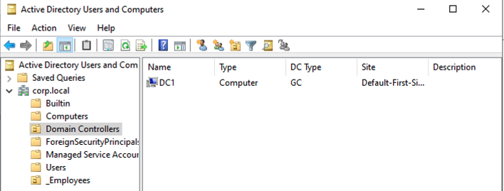

# Active Directory Home Lab

This repository documents a hands-on Active Directory lab environment, showcasing user/group/OU management, GPO hardening, delegation, and share access. It’s designed to demonstrate practical AD and Windows Server skills for employers.

---

## Lab Setup

- **Host machine:** Mac (Apple Silicon)
- **Hypervisor:** Parallels
- **VMs:**
  - `DC2` (Windows Server - Domain Controller)
  - `Windows 11` (Client)
- **Network:** NAT/Host-only

---

## What’s Configured

- Custom OU structure (`GLF-Users`, `GLF-Computers`, `GLF-Groups`)
- Users, security groups, and group membership
- SMB share with group-based permissions
- GPOs for drive mapping, restricting Control Panel, etc.
- Delegated permissions on OUs

---

## Running the Lab

1. Clone this repository.
2. On your DC VM, see [`scripts/build-lab.ps1`](scripts/build-lab.ps1) for a setup script and sample PowerShell commands.
3. Log in as created users on the client. Test group permissions and policy enforcement.

---

## Key Screenshots

| Description                          | Screenshot                                                      |
|---------------------------------------|-----------------------------------------------------------------|
| OU Structure                         |  |
| List computers in GLF-Computers OU    |  |
| List users in GLF-Users OU            |  |
| Group Membership                      |  |
| User Properties                       |   |
| GPO List                              |  |
| GPO Linked to GLF-Users OU            |  |
| Delegated Controls                    |  |
| Share Folder Permissions              |  |
| Password Change at Next Logon         |  |
| Domain Proof (whoami, etc.)           |  |
| ...                                   | *(add more as you see fit)*                                    |

---

## What I Learned

- Automated AD OU/user/group/GPO management using PowerShell
- Group-based access control and delegation
- Troubleshooting and testing Windows authentication, group policy, and resource access between VMs

---

## Scripts

See [`scripts/build-lab.ps1`](scripts/build-lab.ps1) for the full PowerShell build/demo script.

---

## How to Use the Screenshots

- All screenshots are stored in the `Screenshots` folder.
- Reference them in your documentation or presentations.

---

**_For any reviewer: All configuration steps and proof of results are documented in this repo to demonstrate hands-on proficiency with modern Windows Active Directory._**
